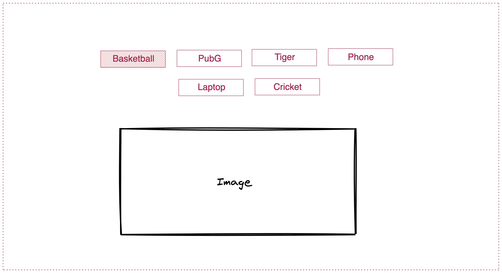

## Show Image

Take a look at the UI of the App:

.

- You need to create multiple buttons for different items with different names
- When user clicks on the button the respective image should be visible on the page
- You will all the required images in the `assets` folder

style.css

*{
margin: 0;
padding: 0;
}

button{
  padding: 10px;
  background-color: blue;
  color: white;
  margin-right: 10px;
  margin-top: 20px;
  border: none;
  border-radius: 5px;
}

h2{
  margin-top: 100px;
  font-size: 30px;
}
img{
  margin-top: 100px;
  width: 500px;
  height: 400px ;
  border-radius: 16px;
}
.active{
  background-color: black;
  color: white;
}
app.js
import React from 'react'

class App extends React.Component{
   constructor(props){
    super(props)
    this.state = {
        active: "Basketball"
    }
   }
    render(){
        let labels = ['basketball','cricket','pubg','tiger','phone'];
        return <>
        

        

            {
            labels.map(label=> <button key = {label} className= {this.state.active=== label ? 'active' : '' } onClick={()=> this.setState({
                active: label
            })}>{label}</button>)
        
            }
        

        
        

        </>
   }
}

export default App;

index.js

import React from 'react'
import ReactDOM  from 'react-dom'
import App from  './App.js'
import './style.css'

ReactDOM.render(<App/>,document.getElementById("root"));

