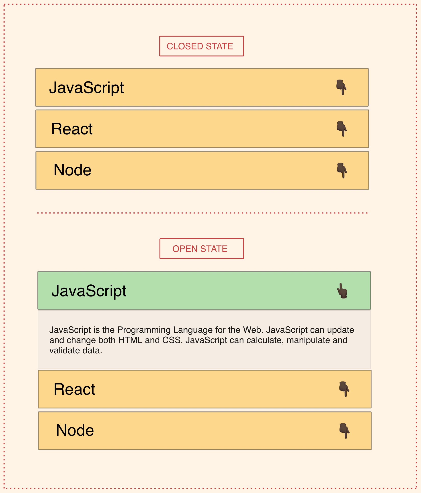

## Accordion FAQ

Take a look at the UI of the App:

.

- Use the data (questions) given below in a closable accordion
- The `Q` (Question) will be visible on the accordion
- The accordion can be in two state `open` and `closed`
- When it is open state only Question will be visible
- Clicking on accordion can show the `A` (Answer)
- Clicking on the accordion will close the visible answer.
- To understand both state have a look at the image given on the top.
- Make sure that only one question is open at a given point in time.

## Data to create this app

```js
let questions = [
  {
    Q: 'Who is it for?',
    A:
      'Recent college graduates, students taking gap year, dropouts, professionals looking to switch careers, anyone learning web development but needs right environment and guidance. No prior programming knowledge required.',
  },
  {
    Q: 'Does AltCampus help me get a job?',
    A:
      'Yes. All we can. We help you at every stage, help you build strong portfolio, prepare for interviews, put you in touch with companies for interview.',
  },
  {
    Q: 'How does the entire process work?',
    A: 'You can read about it here - How it works.',
  },
  {
    Q: 'Is this course self-paced or batched?',
    A:
      'This program follows a blended approach. Students can move at their own pace, however they will be matched with peers learning same concepts.',
  },
];
```
style.css

*{
margin: 0;
padding: 0;
}

@font-face {
  font-family: open-sans regular;
  src: url(OpenSans-Medium.ttf);
}
body{
  font-family: open-sans regular;
}

h1{
  margin-bottom: 30px;
  width: 400px;
  margin-top: 40px;
}

p{
  margin-bottom: 30px;
  width: 400px;
}

h2{
  margin-bottom: 30px;
  width: 400px;
}
App.js
import React from 'react';
import faqs from './data.json'


class App extends React.Component{
    constructor(props){
        super(props)
        this.state = {
            activeIndex: null,
        }
    }
    render(){
        return (
        <>
        <center>
        <h1>ALTCAMPUS FAQ</h1>
        <ul>
            {faqs.map((faq,index)=>(
             <li>
             <h2 onClick={()=>{this.setState({activeIndex:this.state.activeIndex ? null : index})}}>{faq.Q}</h2>
            {index === this.state.activeIndex &&  <p>{faq.A}</p>}
             </li>
        
        
            ))}
        </ul>
        </center>
        </>
 )}

}
export default App;
index.js

import React from 'react'
import ReactDOM  from 'react-dom'
import App from  './App.js'
import './style.css'

ReactDOM.render(<App/>,document.getElementById("root"));
data.json
[
    {
      "Q": "Who is it for?",
      "A":
        "Recent college graduates, students taking gap year, dropouts, professionals looking to switch careers, anyone learning web development but needs right environment and guidance. No prior programming knowledge required."
    },
    {
      "Q": "Does AltCampus help me get a job?",
      "A":
        "Yes. All we can. We help you at every stage, help you build strong portfolio, prepare for interviews, put you in touch with companies for interview."
    },
    {
      "Q": "How does the entire process work?",
      "A": "You can read about it here - How it works."
    },
    {
      "Q": "Is this course self-paced or batched?",
      "A":
        "This program follows a blended approach. Students can move at their own pace, however they will be matched with peers learning same concepts."
    }
  ]


